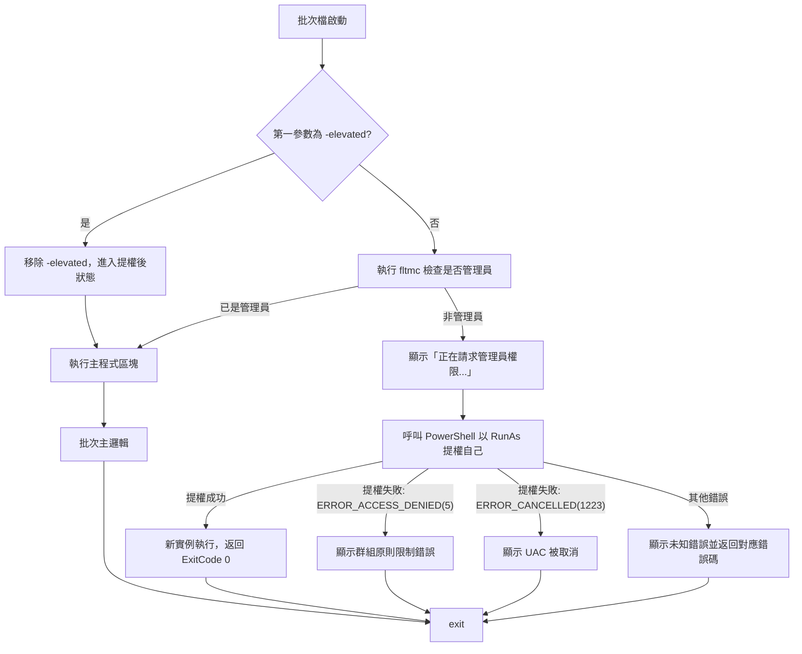

```mermaid
 flowchart TD
    A[批次檔啟動] --> B{第一參數為 -elevated?}
    B -- 是 --> C[移除 -elevated，進入提權後狀態]
    B -- 否 --> D[執行 fltmc 檢查是否管理員]
    C --> G[執行主程式區塊]
    D -- 已是管理員 --> G
    D -- 非管理員 --> E[顯示「正在請求管理員權限...」]
    E --> F[呼叫 PowerShell 以 RunAs 提權自己]
    F -- 提權成功 --> H[新實例執行，返回 ExitCode 0]
    F -- 提權失敗: ERROR_ACCESS_DENIED(5) --> I[顯示群組原則限制錯誤]
    F -- 提權失敗: ERROR_CANCELLED(1223) --> J[顯示 UAC 被取消]
    F -- 其他錯誤 --> K[顯示未知錯誤並返回對應錯誤碼]
    H --> exit
    I --> exit
    J --> exit
    K --> exit
    G --> L[批次主邏輯]
    L --> exit
```
